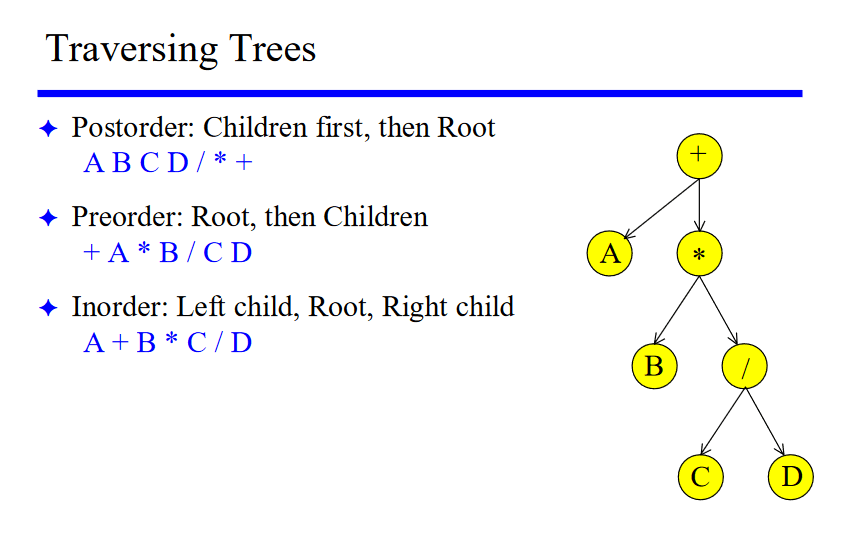
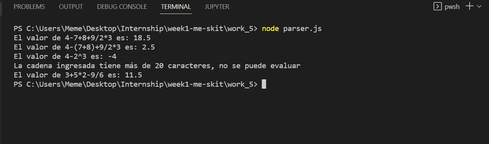

# Analizador de Operaciones Arítmeticas

El primer paso es identificar los simbolos que deben reconocerse.

## Símbolos

### Numeros

- Enteros
- Decimales

### Operadores

- Suma (+)
- Resta (-)
- Multiplicación (*)
- División (/)
- Potencia (^)
- Raiz cuadrada (R)

### Símbolos de agrupación

- Parentesis abierto "("
- Parentesis cerrado ")"

### Solución

Construir una estructura que represente la operación aritmetica en notación postorder.

#### Esquema que representa la logica para la solución:



#### Ejemplo:

Entrada: Expresión inorder `A+B*C/D`, legible para los humanos.

Salida: Expresión postorder `ABCD/*+`, para recorrer y evaluar.

#### Descripción de la solución:

PASO 1: Obtener una estructura en potsorder

Para la solución se utiliza dos estructuras principales: un Stack y la estructura en postorder, ambas se implementan utilizando arrays.

PASO 2: Evaluar la estructura resultante

Luego de tener la expreción aritmetica en postorder recorremos la estructura, cada vez que se encuentra un operador, se extraen los dos proximos operandos a la izquierda, realiza la operación, elimina los elementos operados y en la posicíon del operador se agrega el nuevo valor evaluado.

#### Estructura de la solución:

Se crearon dos clases principales `Parser` y `Calculator`, el parser se encarga de analizar la cadena y generar la estructura en post order.

La clase `Calculator` se encarga de recorrer y reducir la estructura en postorder y retornar un mensaje con el valor o si la cadena es mayor de 20 caracteres, que forma parte de los requerimientos.

## Pruebas

Ejemplo de pruebas realizadas

```
const calculator = new Calculator();
let value = calculator.evaluar('4-7+8+9/2*3');
console.log(value);

value = calculator.evaluar('4-(7+8)+9/2*3');
console.log(value);

value = calculator.evaluar('4-2^3');
console.log(value);

value = calculator.evaluar('(4+8.5+9/(2*3))*2+2^2');
console.log(value);

value = calculator.evaluar('3+5*2-9/6');
console.log(value);
```

Salida:

